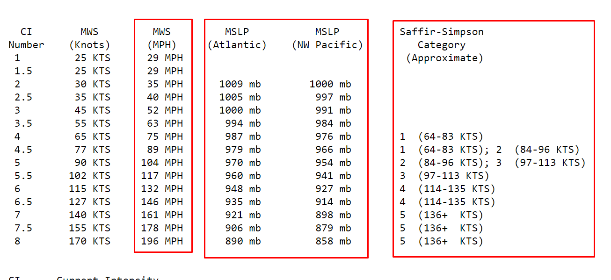

# Introduction

## The Model

Hurricanes remain as one of the deadliest natural disasters on the planet, and the ability to predict information about upcoming hurricanes could save hundreds of lives and help people prepare for what's to come.

### Hurricane Windspeed Forecasting using Long Short Term Memory (LSTM) Recurrent Neural Networks (RNN)

Utilizing a Long Short Term Memory (LSTM) Recurrent Neural Network (RNN) to forecast the windspeeds of future hurricanes, our project aims to develop a unique, effective, and easy-to-use model that allows for various input parameters.

To create predictions, you can use our interactive app that contains sliders which allow you to precisely enter inputs such as date, longitude, latitude and more to get an output in seconds for the windspeed at given those paramters. Based on these predicted results, one can easily determine the severity and category of the predicted hurricane.

## Overview of Long Short Term Memory (LSTM)

As mentioned above, LSTM is a Recurrent Neural Network that can be used for time-series forecasting. LSTM solves the vanishing gradient problem that was common in earlier neural network models by implementing a forget layer. In short, it has an input, cell, forget, and output layer. In context of our project, it trains on data using features such as `Latitude`, `Longitude`, `Max_Central_Pressure` and other features to create a prediction for `tmrw_windspeed`.

# Instructions

This repo provides scripts and examples that can help you predict hurricanes on your own computer. The repo also provides a [Jupyter Notebook](<https://github.com/AadiTiwar1/HurricanePredictionUsingLSTM/blob/main/src/HurricanePredictionDraft1%20(3).ipynb>) which contains all of the code in one place with text descriptions for the easisest learning experience. [Note: We highly reccomend just downloading the Jupyter Notebook and running that instead of downloading the entire project and running the files!] For a more file-seperated based version, our Repo structure and brief description of content is provided below:

```
├── app/
├── scripts/
│   ├── download_data.py
│   ├── install_dependencies.py
│   ├── train_model.py
│   └── launch_app.py
├── src/
├── static/dataset
├── .project-metadata.yaml
├── README.md
└── requirements.txt
```

## Install dependencies

Python version >= 3.7 and <= 3.10

- `pandas===1.3.4`
- `utils===1.0.1`
- `numpy===1.23.3`
- `matplotlib===3.5.3`
- `torch===1.13.1`
- `streamlit===1.17.0`
- `tensorflow===2.11.0`
- `scikit-learn===1.2.0`

`pip3 install -r requirements.txt`

## Download data

To download the data, run the following command:

`python scripts/download_data.py`

## Launch app

To launch the app, run the following command:

`streamlit run app/app.py` or `python -m streamlit run app/app.py` if the streamlit command does not work
Running the app will also allow you to train the model so you can skip the next step if you want.

## Train model

To train the model, run the following command:

`python app/model.py`

# Sources

This repo is inspired from the contents of this [repo](https://github.com/DikshantDulal/SoftServe_QLSTM) which uses LSTM for stock prediction. We utilized the LSTM aspect of the project to Hurricane data and developed different columns with various learning rates and epochs to maximize accuracy.

### Categorization of hurricanes given windspeed and pressure


[NOAA](https://www.ssd.noaa.gov/PS/TROP/CI-chart.html)
